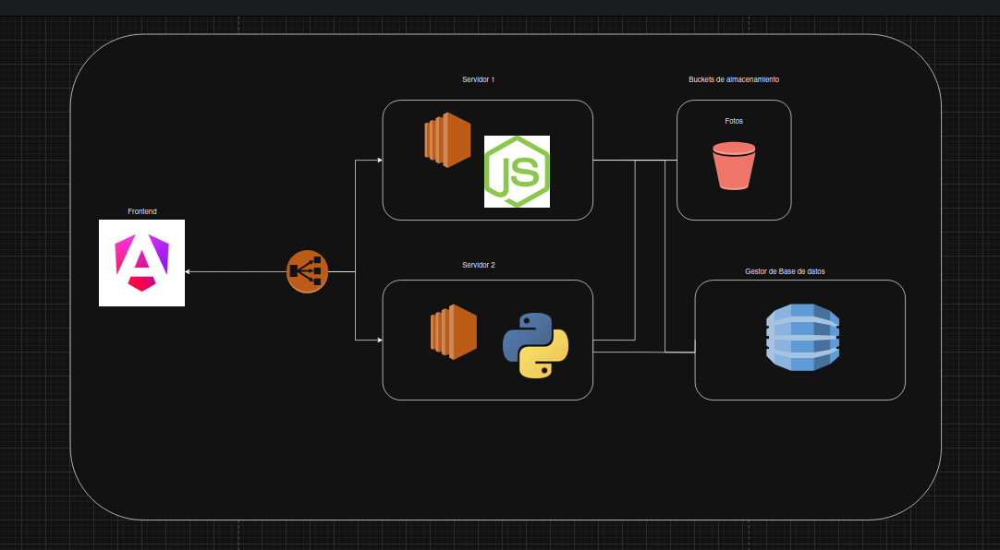
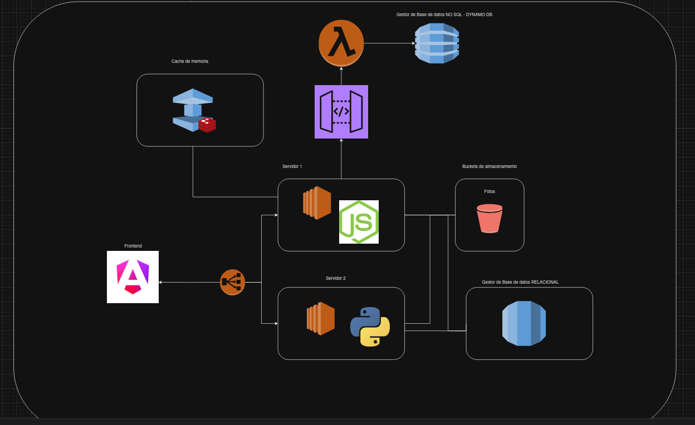
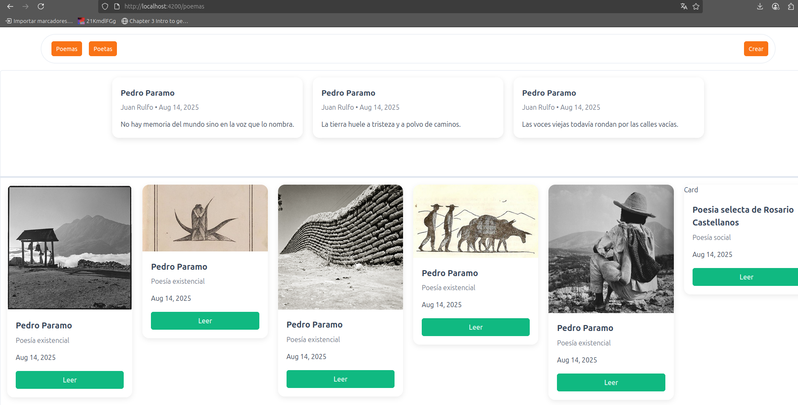

# Evolucion de arquitectura
## 14 agosto - Comunicacion EC2's con Load balancer a S3 (web estatico) y comunicacion a bucket S3 y RDS como gestor de BD

## 28 agosto - Elastic cache de redis y gateway a lambda

# Vista de pagina princial
## 28 agosto - poemas generales y top 3 

## 18 septiembre - Arquitectura Microservicios

